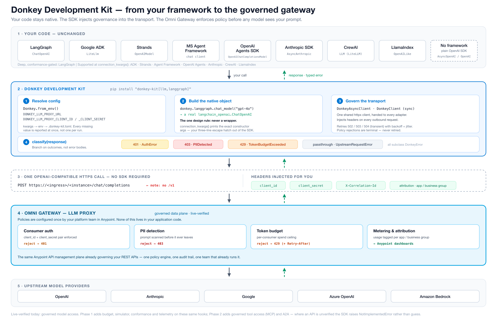

# Architecture

This document is the contributor-facing map of how the SDK is built — the layer
boundaries, the design invariants, and the discipline that keeps the package
trustworthy. It is a distillation, not the spec. The authoritative specs are
[`spec/agent-fabric-sdk-build-plan.md`](spec/agent-fabric-sdk-build-plan.md)
(phases, milestones, standing invariants) and
[`spec/agent-fabric-sdk-build-guide.md`](spec/agent-fabric-sdk-build-guide.md)
(feature scope, cited as `BG §N.N`). A **bare** `§N.N` reference below points
into the archived v1 plan at
[`spec/archive/agent-fabric-sdk-build-plan-v1.md`](spec/archive/agent-fabric-sdk-build-plan-v1.md),
which is where most existing citations in the tree still resolve. When a rule
here feels arbitrary, read the cited section — the constraints are deliberate.

For *using* the SDK, see the consumer docs site (`website/`). For *working in*
the repo — branch/PR flow, testing surfaces, coding conventions — see
[`CONTRIBUTING.md`](CONTRIBUTING.md).



The SDK is a thin, framework-native client for a **governed gateway**. Your agent
code stays in whatever framework you already use; the SDK's only job is to build
that framework's *own* native client object, inject governance and attribution
headers into the transport, and turn the gateway's policy rejections into typed,
actionable errors. The gateway — not the SDK — enforces policy.

---

## Layered architecture (§1.1)

The package is a strict stack. Higher layers depend on lower layers; **no lower
layer may import a higher one.**

```
integrations/   per-framework adapters — return NATIVE framework objects, never wrappers
      ↓         (langgraph · adk · strands · agent_framework · openai · crewai · anthropic · llamaindex)
tools/          MCP session management, tool discovery/filtering — resolves registry handles
      ↓
registry/       Exchange discovery, typed governed-state assets
      ↓
llm/            framework-free OpenAI-compatible client factory + model catalog
      ↓
core/           config · auth · transport · errors · telemetry · region  — ZERO framework deps (httpx + pydantic only)

provisioning/   separate, CI-oriented entry point: declarative specs · plan/diff/apply · governance lint · CLI
```

**The hard rule (§1.1):** `core/` has no dependency on any agent framework.
Each `integrations/*` adapter may depend on exactly one framework, and nothing
in `integrations/` may be imported by `core`, `llm`, `registry`, or `tools`.
This is enforced in CI by `import-linter` (`lint-imports`); a violating import
fails the build. The `base-only` CI job additionally installs *only* the base
package and imports `agent_fabric` to catch an accidental top-level framework
import leaking into a lower layer.

Because of that rule, adapters import their framework **lazily, inside methods** —
never at module top level — so importing the base package never drags in a
framework that may not be installed.

### How the pieces connect

- **`Fabric`** is the public surface and orchestrator. It owns one shared
  **`FabricAsyncClient`** (an `httpx.AsyncClient` subclass that injects the
  governance/attribution headers) and hands that single client to the LLM
  client, the registry, and every adapter — so there is exactly one transport and
  one header-injection point.
- **Adapters are lazy attributes.** `Fabric.__getattr__` resolves
  `fabric.<framework>` on first access through the `ADAPTERS` registry declared
  in `integrations/__init__.py`. Accessing an adapter whose optional extra is not
  installed raises an `ImportError` carrying the exact `pip install` command —
  never a bare `ModuleNotFoundError`. Each adapter returns the framework's own
  object (e.g. a real `langchain_openai.ChatOpenAI`), so there is nothing to
  unlearn and a three-line escape hatch (`connection_kwargs()`) out of the SDK.
- **Configuration** resolves in a fixed precedence — constructor kwargs → env
  vars → `.agent-fabric.toml` → default (§2.1) — and reports every missing field
  at once rather than one failure per run. `Fabric.from_env()` is the entry point.

Every governed surface ships in three ergonomic forms that must stay in lockstep:
the `fabric.<framework>` factory, a `connection_kwargs()` accessor, and a
module-level factory.

---

## Verification discipline (§0.3)

This is the SDK's most distinctive principle and its strongest trust guarantee.

> **Never invent an endpoint, header name, or class name.**

A fabricated endpoint that 404s in a customer sandbox destroys confidence in the
whole package, so the codebase makes fabrication structurally hard. `core/_verify.py`
is the single home for every value that §0.3 says must be confirmed against a real
Anypoint sandbox before it can be trusted, and it offers exactly two mechanisms:

- **`blocked("…")`** returns a `NotImplementedError("blocked on verification: …")`.
  It is used where there is no defensible placeholder at all — e.g. the MCP-bridge
  tool-discovery and the provisioning control-plane endpoints. The SDK raises
  rather than guesses. **Do not replace a `blocked(...)` guard with a guess.**
- **`Unverified(...)`** placeholder constants hold a documented best-guess that is
  fully overridable via config/env, and emit a one-time `UnverifiedValueWarning`
  the first time they are read — so a value can be *used* without ever being
  *mistaken for confirmed*. A customer can point it at the real value immediately;
  we don't block them waiting on our own verification.

**How a value flips to verified.** When a value is confirmed against a sandbox,
two edits move together, never apart: flip its row in
[`docs/verified-apis.md`](docs/verified-apis.md) to `VERIFIED`, **and** set
`verified=True` on its `Unverified(...)` entry in `core/_verify.py` so the warning
stops firing. `docs/verified-apis.md` is the single source of truth for what is
verified and the worklist of what is still blocked.

What is verified today: the LLM-proxy data plane (its base-URL shape — note there
is **no `/v1`** — the `client_id`/`client_secret` request-header pair, streaming,
and the live rejection shapes), the OAuth2 control-plane token path, and the
CLI-plugin REST contract (from static analysis). Still blocked: Exchange→MCP tool
discovery, the provisioning control plane, and the exact framework-adapter class
names/kwargs (§8–§10).

---

## Error-taxonomy design (§2.4)

Turning the gateway's policy rejections into catchable, actionable exceptions is
the SDK's clearest value over raw HTTP. Two invariants govern the taxonomy in
`core/errors.py`:

1. **A policy refusal is never retried.** `PolicyViolation` (and its subclasses —
   `TokenBudgetExceeded`, `PIIDetected`, `PromptInjectionBlocked`,
   `ContentSafetyBlocked`) must be distinguishable from a transient error at the
   framework boundary, so a host framework never silently retries a governance
   refusal. The transport treats these as terminal.
2. **Every error carries a `remediation`.** On `PolicyViolation` the human-readable
   next step is a *required* field — the concrete action to take (e.g. "the budget
   window resets in 42m; request an increase in API Manager") is worth more than a
   stack trace.

**`classify()` is fixture-driven, not guessed.** The HTTP-response → exception
mapping in `classify()` is populated from real rejection captures taken against a
live governed proxy (§8.2), not hand-written assumptions. The authoritative
discriminator is the error **`type`** plus specific headers — **not the status
code alone.** The captures established, for example, that:

- A **PII** block is a **403** with a *nested* error object whose `type` is
  `"pii_detected"` and **no** `www-authenticate` header — so it is decided *before*
  the generic 401/403→auth rule (`AuthError`). A 403 is not automatically an auth
  error.
- A **token-budget** rejection is a **429** with an *empty body*; the budget state
  lives entirely in headers (`x-token-reset` in ms), with no standard `retry-after`
  → `TokenBudgetExceeded`.
- An **upstream provider** rejection (e.g. OpenAI `model_not_found`) is a non-429
  4xx carrying the provider's nested `code`/`type`/`param`, passed through
  verbatim → `UpstreamRequestError` (terminal, but distinct from a policy refusal).
- A **5xx** is a retryable provider outage → `UpstreamModelError`.

Policies not yet observed live (prompt-injection, content-safety) deliberately
fall through to a generic `PolicyViolation` whose message *says so* rather than
pretending to a precision the captures don't yet support — the same §0.3 honesty
as the verification ledger. All errors subclass `FabricError`, which carries the
correlation/request IDs and the raw response for inspection.

---

## Framework tiering (§1.4)

Not every framework gets the same CI guarantee, and the roster is deliberately
scoped rather than exhaustive.

- **Tier 1 — full support, conformance-gated, *blocking* CI:** LangGraph,
  Google ADK, Strands, Microsoft Agent Framework, OpenAI Agents SDK, Anthropic
  SDK, CrewAI.
- **Tier 2 — supported, conformance-gated, *non-blocking* CI:** LlamaIndex.
- **Tier 3:** none. AutoGen and Semantic Kernel are intentionally out of scope —
  Microsoft positions Agent Framework as their direct successor, so carrying all
  three would mean shipping two sunset-path adapters.

**Conformance is how "supported" is proven, not asserted.** One suite
(`python/tests/conformance/suite.py`) runs identically against every adapter. A
framework is "supported" only when it passes every scenario **or** records an
*asserted exemption* in `KNOWN_LIMITATIONS` — never a silent skip. Those
exemptions are published in the README as credibility (e.g. adapters that reach
models through LiteLLM cannot propagate a per-run correlation ID, because LiteLLM
owns the transport). Tier-1 conformance blocks CI; Tier-2 (LlamaIndex) runs
non-blocking.

Two Tier-1 targets carry documented conformance exemptions rather than a lower
tier: CrewAI (per-run correlation degrades to per-client because it reaches models
through LiteLLM, like ADK) and the Anthropic SDK (depends on the proxy exposing an
Anthropic-native Messages API route, an open verification item, §0.3).

---

## Related documents

- [`spec/agent-fabric-sdk-build-plan.md`](spec/agent-fabric-sdk-build-plan.md) — the
  authoritative plan: phases, milestones, label taxonomy, standing invariants.
- [`spec/agent-fabric-sdk-build-guide.md`](spec/agent-fabric-sdk-build-guide.md) —
  feature-by-feature scope and acceptance bars; cited as `BG §N.N`.
- [`spec/archive/agent-fabric-sdk-build-plan-v1.md`](spec/archive/agent-fabric-sdk-build-plan-v1.md) —
  archived v1 plan, not authoritative; a bare `§N.N` resolves here.
- [`docs/verified-apis.md`](docs/verified-apis.md) — the §0.3 verification ledger
  (source of truth for what is verified vs. blocked).
- [`CONTRIBUTING.md`](CONTRIBUTING.md) — branch/PR/release flow, testing surfaces,
  coding conventions.
- `website/` — the consumer "how to use the SDK" documentation.

---

*"Agent Fabric", "Anypoint", and "Omni Gateway" are Salesforce trademarks; this
project is a descriptive, non-first-party SDK for consuming those capabilities
(§0.4).*
